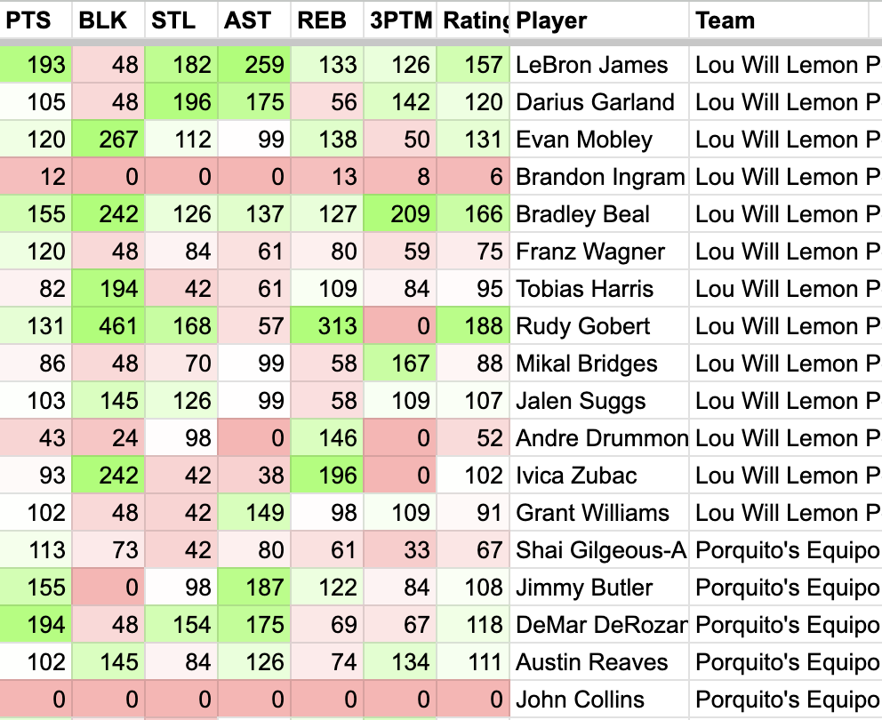

<a target="_blank" href="https://www.python.org/downloads/" title="Python version"></a>

# ESPN NBA Fantasy Analyzer

### Generates overall, and category player valuations over various timespans

Thanks to [cwendt94/espn-api](https://github.com/cwendt94/espn-api) for fetching data from ESPN.

## Setup:

### [Video with setup and explanation](https://www.youtube.com/watch?v=rRVzx607mJM)

Requires pandas, gspread, gspread-formatting, espn-api, and simple-term-menu packages:

```
python3 -m pip install pandas gspread gspread-formatting espn-api simple-term-menu
```

Required [Google gspread setup](https://docs.gspread.org/en/latest/oauth2.html) to allow pushing to Google Sheet. Local Excel spreadhsheets not yet implemented.

To install, either download and unpack the .zip, or run:

```
git clone https://github.com/martincham/espn-nba-fantasy-analyzer
```

### [See the Wiki for in-depth setup instructions](https://github.com/martincham/espn-nba-fantasy-analyzer/wiki/Getting-Started-with-ENFA)

## Using the tool:

to run (while [in the folder](https://www.geeksforgeeks.org/cd-command-in-linux-with-examples/)):

```
  python3 main.py
```

### Main Menu

```
ESPN Fantasy League: YOUR_LEAGUE_NAME_HERE
Season: 2024
Last refreshed: Sat Apr 20 19:34:39 2024
Selected Google Sheet: testSheet

ESPN Fantasy BBALL Analyzer
> [1] Load/Refresh League
  [2] Google Sheets Menu

  [4] Settings

  [6] Exit
```

_[1] Refresh League_ will pull data for your league from ESPN. The data will be stored in the folder. You only need to refresh when new games have been played.

### Google Sheet Menu

```
Google Sheet:
> [1] Push Google Sheet
  [2] Initialize/Reformat Google Sheet
  [3] Clear Google Sheet
  [4] Set Sheet Name

  [6] Back
```

_[1] Push_ runs all the algorithms and pushes data to your GSheet.

_[2] Initialize/Reformat_ Will setup color coding and other formatting. Run this once **before** you push data, and every time you change categories.

_[3 Clear]_ Will delete all the data from your sheets. Usefull for when you've removed categories.

Sheet name must match exactly. I suggest **no spaces**! eg: "fantasyStatsSheet24-25"

### Settings Menu

```
Settings:
> [1] Set ESPN Info
  [2] Set Season


  [6] Back
```

You can either manually edit the json in settings.txt, or you can use this settings menu.

### ESPN Info Menu

```
Change ESPN Info:
> [1] Set SWID
  [2] Set espn_s2
  [3] Set league_id
  [2] Set team number

  [6] Exit
```

### [See the Wiki for details on the Settings and settings.txt](https://github.com/martincham/espn-nba-fantasy-analyzer/wiki/Settings-Details)

SWID and espn_s2 required for private leagues, ([finding SWID and espn_s2](https://github.com/cwendt94/espn-api/discussions/150)), league_id is required for all leagues. Your team number is required to calculate remaining value.

## Reading the Data:

This utility scores players where 100 is the **average production of players rostered in your league**, over the specified timespan. Averages can shift as players are rostered/dropped. A score of 200 will have double the production, 50 will have half. Rating will use all stats in "categories" unless in "ignoredStats".



If the average number of Points per Game (PPG) is 15, a player with 15 PPG will have a rating of 100. A player with 30 PPG will be rated 200.
If the average number of Steals per Game (SPG) is .8, a player with .8 SPG will have a rating of 100. A player with 1.6 SPG will be rated 200. The 1.6 SPG player is as valuable as the 30 PPG player (in fantasy).


There are two of each type of sheet, one for rostered players, and one for free-agents.

| Rostered | Free-Agents | Description                                                                                 |
| -------- | ----------- | ------------------------------------------------------------------------------------------- |
| total    | FA          | Rates players based on total stat accrual. Players who play more will be valued higher.     |
| pG       | FApG        | Rates players based on per game stats. Will not devalue based on time missed due to injury. |
| cats     | FAcats      | Individual rating for stats in "categories". Used total, not perGame numbers                |
| 7/15/30  | FA7/15/30   | ^Same, but over last 7 days, 15 days, 30 days                                               |
| remValue | FArem       | Rates players based on their schedule fit in your roster. _see below_                       |
| matchups |             | Compares your value each day to your opponent.                                              |
|          | FAp32       | Rates Free Agents per 32 minutes. Can also show playing time trends.                        |

Remaining value: For example, if you have a few Spurs on your roster, another Spur would sit on your bench and would maybe play only 10 games in the last X weeks of the season. Perhaps the Sun's schedule plays on different days than the players you have rostered so a Sun's player would play 30 games in the remaining X weeks. Even if the Sun player is worse, because they can play more on your roster, their remaining value would be higher. This functionality is being tuned, but you can adjust your performance by making "ignorePlayers" equal to the number of players you drop/add each week, and "maxPlayers" equal to 1 less than the max players on your team.
